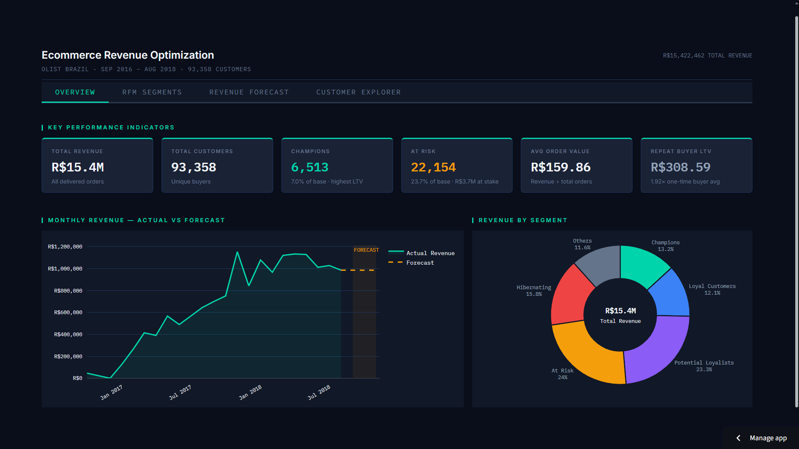
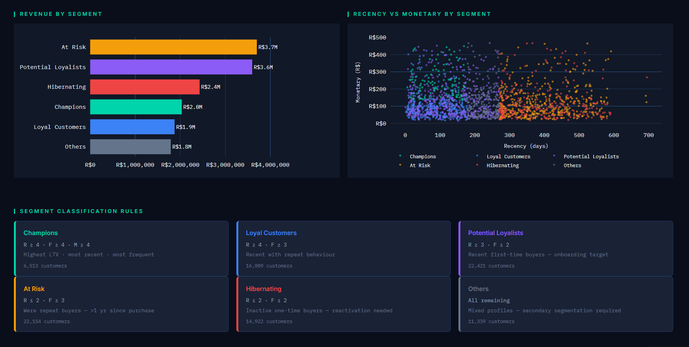
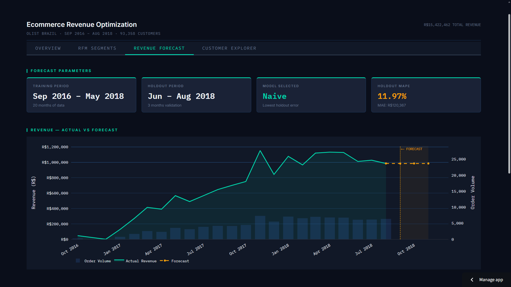
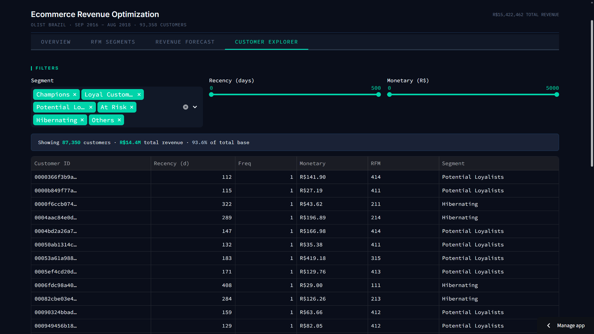

[](https://ecommerce-revenue-optimization.streamlit.app)

**Live app:** [https://ecommerce-revenue-optimization.streamlit.app](https://ecommerce-revenue-optimization.streamlit.app)

# E-commerce Revenue Optimization (Olist)

## Exploratory Analysis, Customer Segmentation, and Revenue Forecasting

This project analyzes the **Olist Brazilian e-commerce dataset** to understand revenue dynamics, customer behavior, and churn risk.  
It demonstrates an end-to-end analytics workflow using **SQL, Python, and an interactive Streamlit dashboard**, with a focus on **business decision-making** and reproducibility.

---

## Dashboard

<table>
  <tr>
    <td align="center"><strong>📊 Overview</strong></td>
    <td align="center"><strong>🎯 RFM Segments</strong></td>
  </tr>
  <tr>
    <td></td>
    <td></td>
  </tr>
  <tr>
    <td align="center"><strong>📈 Revenue Forecast</strong></td>
    <td align="center"><strong>🔍 Customer Explorer</strong></td>
  </tr>
  <tr>
    <td></td>
    <td></td>
  </tr>
</table>

Six KPI cards and a combined actual-vs-forecast revenue line chart sit alongside a segment revenue donut — the Overview tab gives an immediate read on platform health. The RFM Segments tab breaks down all six customer segments by revenue, recency, frequency, and monetary value, with an inline revenue-share bar per row. The Revenue Forecast tab shows the dual-axis chart of monthly revenue and order volume, the model comparison table, and a terminal-style insight callout. The Customer Explorer tab provides live filtering, paginated browsing of all 93,358 customers, a CSV download, and an RFM score heatmap of average spend.

---

## Project Objectives

- Analyze how revenue and order volume evolved over time
- Identify high-value and at-risk customer segments
- Quantify revenue concentration and churn risk
- Provide a realistic short-term revenue outlook
- Generate clean, reproducible datasets for BI consumption

---

## Key Insights

- Revenue grew rapidly throughout **2017** and plateaued in **2018**, indicating a transition from growth to maturity
- The customer base is dominated by **one-time buyers**, while repeat customers generate significantly higher average revenue
- RFM segmentation shows that a substantial share of revenue comes from **At Risk** and **Hibernating** customers
- Due to limited historical depth, complex seasonal models were not appropriate; a **naive forecasting baseline** achieved the lowest holdout error and was selected

---

## Repository Structure

```
ecommerce-revenue-optimization/
├── app/
│   └── streamlit_app.py
├── data/
│   ├── raw/
│   └── processed/
├── notebooks/
├── outputs/
├── scripts/
├── sql/
├── .streamlit/
│   └── config.toml
├── build_db.py
├── run_sql_models.py
├── check_db.py
├── requirements.txt
├── requirements_app.txt
└── README.md
```

---

## Methodology

### 1. Data Modeling (SQL / SQLite)

- Built a local SQLite database from raw transactional CSV files
- Defined analytical tables using a fact/dimension approach:
  - `fact_orders`
  - `fact_order_items`
  - `dim_customers_agg`
- Applied explicit business rules (delivered orders only)

---

### 2. Exploratory Data Analysis (EDA)

- Validated schema, missing values, and data integrity
- Analyzed:
  - Monthly revenue and order volume trends
  - Average order value (AOV)
  - Category and geographic revenue concentration
  - Repeat vs one-time customer behavior

Notebook:
- `notebooks/01_eda.ipynb`

---

### 3. Customer Segmentation (RFM)

- Engineered customer-level features:
  - **Recency:** Days since last purchase
  - **Frequency:** Number of completed orders
  - **Monetary:** Total customer spend
- Used quantile-based scoring (1–5)
- Grouped customers into actionable segments:
  - Champions
  - Loyal Customers
  - Potential Loyalists
  - At Risk
  - Hibernating

Notebook:
- `notebooks/02_rfm_segmentation.ipynb`

---

### 4. Revenue Forecasting

- Constructed a monthly revenue time series from delivered orders
- Used a holdout window to avoid leakage
- Compared naive and ETS models
- Selected the naive model due to limited historical depth

Notebook:
- `notebooks/03_revenue_forecasting.ipynb`

---

## BI-Ready Outputs

- `monthly_revenue_actual.csv`
- `rfm_segments.csv`
- `rfm_segment_summary.csv`
- `revenue_forecast_total.csv`
- `forecast_model_comparison.csv`

---

## How to Run Locally

### Environment Setup

```
python -m venv .venv
.venv\Scripts\Activate.ps1
pip install -r requirements.txt
pip install -r requirements_app.txt
```

### Build Database

```
python build_db.py
python run_sql_models.py
python check_db.py
```

### Run Analysis Notebooks

1. `01_eda.ipynb`
2. `02_rfm_segmentation.ipynb`
3. `03_revenue_forecasting.ipynb`

### Build Processed Data Inputs

```
python scripts/build_monthly_revenue_actual.py
```

### Run Streamlit App

```
streamlit run app/streamlit_app.py
```

---

## Tech Stack


---

## Data Source

Public **Olist Brazilian E-commerce Dataset**.  
Raw data files and the SQLite database are excluded due to size and licensing considerations.

---

## Notes and Limitations

- Forecasting is intentionally short-term and baseline-focused
- Segmentation is optimized for business actionability
- ETS models were evaluated but excluded due to convergence failure on the ~20-month training set

---
